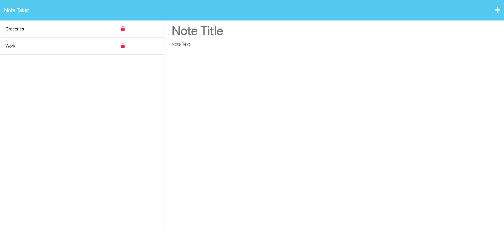

# Note Taker | Challenge 11

## Description

I modified starter code to create an application called Note Taker that can be used to write and save notes. This application uses an Express.js back end and will save and retrieve note data from a JSON file. It also enables the user to delete saved note data.

## Tech Used

- Express
- Node
- Heroku

## Usage

File can used and shared to for knowledge expansion or general use as required. 

Screenshot: 

## Credit

- Starter code by a-nyx

## Links

- GitHub repository URL: https://github.com/cherah-petra/NoteTakerChallenge11
- Heroku Page: https://note-taker74.herokuapp.com/notes
